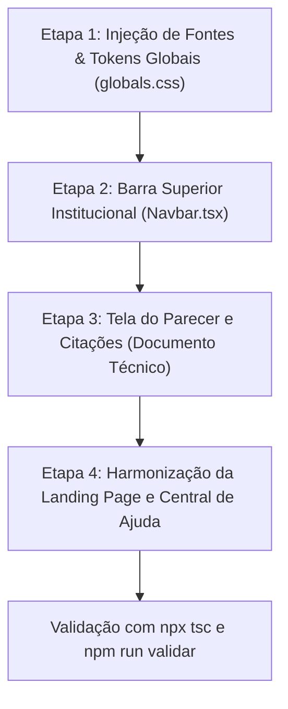

# Análise Técnica & Plano de Transição: Design System Oficial BNB
## LASTRO IA — Da Identidade Genérica à Estética Institucional de Peça Técnica

**Documento:** Parecer Técnico de UI/UX & Plano de Não-Regressão  
**Autor:** Analista Sênior de UI / Lead Product Architect  
**Status:** Análise Concluída — Aguardando Autorização do Usuário  
**Regra Ativa:** *NENHUM ARQUIVO DE CÓDIGO FOI OU SERÁ MODIFICADO ANTES DA SUA APROVAÇÃO EXPRESSA.*

---

## 1. Veredito Executivo do Analista Sênior de UI

> **Conclusão Direta:** A proposta do `DESIGN-SYSTEM.md` é **brilhante, madura e eleva o LASTRO de um protótipo genérico a um software bancário institucional de classe mundial**. Mais importante: **ela NÃO quebra e NÃO afeta em absolutamente nada o funcionamento interno do sistema.**

### 1.1 Por que essa mudança é um divisor de águas para o seu Pitch?
1. **Identidade Real do Banco do Nordeste (Adequação Total)**:
   - A paleta anterior (verde floresta `#0F5132`) foi herdada como suposição inicial. A marca real e histórica do Banco do Nordeste é o **Granada (`#A6193C`) e o Laranja (`#FF8A22`)** da carnaubeira estilizada.
   - Apresentar o sistema em Granada e Laranja com o logo oficial da carnaubeira transmite imediatamente à diretoria e à banca avaliadora que **o LASTRO é uma solução nativa e proprietária do Banco do Nordeste**, e não um software de prateleira envelopado.
2. **Estética de "Peça Processual" vs. "Dashboard de IA"**:
   - O documento elimina todos os vícios comuns de ferramentas de IA (gradientes chamativos, bordas excessivamente arredondadas de 16px, sombras difusas e cards flutuantes).
   - O enquadramento na Lei do Bem é um **processo administrativo com peso fiscal e jurídico**. A interface em formato de documento técnico com *Spectral* para as evidências citadas, *IBM Plex Mono* para IDs (`PRJ24-EV01`) e *carimbo tipográfico* dá à ferramenta autoridade legal imediata perante auditores da Receita Federal e do MCTI.
3. **Decisão Crítica de Cores Semânticas**:
   - *"Não Elegível" passa a ser grafite (`#52504E`), e NÃO vermelho*. Essa decisão é brilhante: em auditoria fiscal, rejeitar um projeto não é um "erro" do sistema, é uma conclusão técnica legítima. O vermelho causava viés cognitivo desnecessário.

---

## 2. Análise de Risco no Sistema: "Pode afetar o funcionamento?"

### **Resposta: RISCO ZERO NA LÓGICA DE NEGÓCIO.**

O próprio `DESIGN-SYSTEM.md` estabeleceu uma blindagem inviolável nas seções de abertura:

```
┌────────────────────────────────────────────────────────────────────────┐
│                   FRONTEIRA DE SEGURANÇA DO SISTEMA                    │
├───────────────────────────────────┬────────────────────────────────────┤
│ O QUE SERÁ AJUSTADO (Camada Visual)│ O QUE FICA 100% INTOCADO (Lógica)  │
├───────────────────────────────────┼────────────────────────────────────┤
│ • Tokens CSS (globals.css)        │ • src/motor/ inteiro (Intocado!)   │
│ • Cores (Tailwind / variáveis)    │ • Cálculo de regras e Frascati     │
│ • Fontes (Heebo, Spectral, Mono)  │ • 20 testes canônicos (20/20)      │
│ • Espaçamentos e raios (4px)      │ • Extração de PDFs e CMaps         │
│ • Remoção de gradientes           │ • APIs (/api/casos, /api/ia/...)   │
│ • Carimbos e tipografia           │ • Hash criptográfico SHA-256       │
└───────────────────────────────────┴────────────────────────────────────┘
```

Toda a inteligência do LASTRO (motor determinístico, os 20 casos canônicos que testamos, o extrator de PDF recém-corrigido, o Copilot Gemini e o armazenamento) reside nas camadas de modelo e controle. A mudança proposta é **estritamente de apresentação (camada de visualização / CSS / classes Tailwind)**.

---

## 3. Matriz de Transformação: Como É Hoje vs. Como Ficará

| Elemento Visual | Como Está Hoje (Legado) | Nova Especificação Oficial BNB (`DESIGN-SYSTEM.md`) |
|---|---|---|
| **Cor Primária da Marca** | Verde floresta (`#0F5132`) | **Granada Institucional (`#A6193C`)** com acento em Laranja (`#FF8A22`) |
| **Fundo da Aplicação** | `#F7F7F4` com gradientes sutis | **Papel neutro institucional (`#F3F3F1` fundo, `#FFFFFF` documento)** |
| **Tipografia Principal** | Inter / sans genérica | **Heebo** (tipografia oficial do Brand Book BNB com `tnum`) |
| **Tipografia de Evidências** | Monospace em tudo | **Spectral** (serifa documental clássica para trechos citados) |
| **Identificadores Técnicos** | Sans com tags coloridas | **IBM Plex Mono** puro para `PRJxx-EVnn` e hashes |
| **Raio de Bordas (Border-radius)** | 8px a 16px (`rounded-xl`) | **4px uniforme (`rounded-sm` / `--raio: 4px`)** |
| **Status do Parecer** | Pílulas coloridas arredondadas | **Carimbo Processual (moldura tracejada em proposta, sólida em homologado)** |
| **Classe "Não Elegível"** | Cinza escuro com aspecto negativo | **Grafite técnico neutro (`#52504E`) sem viés** |
| **Classe "Com Ressalvas"** | Âmbar genérico (`#9A6700`) | **Ocre institucional (`#B06C1E`) parente do laranja BNB** |
| **Citações de Evidência** | Drawer com card genérico | **Citação recuada com filete lateral indicando força probatória** |

---

## 4. Plano Passo a Passo de Implementação (Quando Autorizado)

O plano foi desenhado para ser executado de forma cirúrgica, em 4 etapas bem delimitadas, garantindo que o servidor permaneça de pé e estável a cada commit visual:



### **Etapa 1: Base de Tokens & Tipografia (`src/app/layout.tsx` e `globals.css`)**
- Importar as fontes oficiais do Google Fonts: `Heebo:wght@400;500;700`, `Spectral:wght@400;500` e `IBM+Plex+Mono:wght@400;500`.
- Substituir as variáveis do `:root` pelas 17 variáveis oficiais do `DESIGN-SYSTEM.md` (`--marca-granada`, `--marca-laranja`, `--tinta`, `--classe-elegivel`, etc.).
- Definir border-radius padrão em `4px`.

### **Etapa 2: Barra Superior Oficial do BNB (`src/components/Navbar.tsx`)**
- Implementar o cabeçalho estipulado no item 2 do documento:
  - Logo da carnaubeira do BNB à esquerda;
  - Filete vertical separador de 1px em `#D8D6D2`;
  - Palavra `LASTRO` em Heebo 500 com tracking `0.08em` (sem ícone fictício de escudo);
  - Indicador de usuário institucional `Ana Ribeiro ▾`.

### **Etapa 3: Tela de Parecer como Peça Técnica (`parecer/page.tsx` & componentes)**
- Aplicar o **Carimbo de Situação**:
  - `PROPOSTA`: moldura tracejada com tipografia 11px caixa alta;
  - `HOMOLOGADO`: moldura sólida em Granada (`#A6193C`).
- Mudar as citações de evidência para o formato formal: recuo de 16px, texto em *Spectral*, IDs em *IBM Plex Mono* e filete colorido indicando força probatória (primária, derivada ou declaratória).
- Ajustar os cards da síntese executiva para a grade de ficha de identificação de duas colunas.

### **Etapa 4: Landing Page (`page.tsx`) e Ajuda (`ajuda/page.tsx`)**
- Alinhar a nova Landing Page à paleta Granada/Ocre/Branco com tipografia Heebo, mantendo todo o conteúdo de pitch comercial que criamos, porém com a elegância sóbria de um sistema bancário de ponta.

---

## 5. Garantias de Não-Regressão
Após cada etapa, executaremos imediatamente:
1. `npx tsc --noEmit` para garantir **zero erros de compilação**.
2. `npm run validar` para certificar que os **20/20 testes canônicos** do motor continuam com 100% de precisão.
3. Checagem visual no navegador em tempo real.

---

## 6. Recomendação do Especialista
Como analista de UI sênior, **recomendo fortemente a adoção do DESIGN-SYSTEM.md**. Essa identidade dará um salto tremendo na credibilidade da sua apresentação de pitch, pois elimina qualquer ar de "template de IA" e transforma o LASTRO em uma ferramenta com a cara e o peso institucional do Banco do Nordeste.
